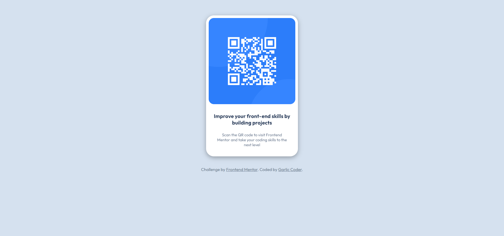

# Frontend Mentor - QR code component solution

This is a solution to the [QR code component challenge on Frontend Mentor](https://www.frontendmentor.io/challenges/qr-code-component-iux_sIO_H). Frontend Mentor challenges help you improve your coding skills by building realistic projects. 

## Table of contents

- [Overview](#overview)
  - [Screenshot](#screenshot)
  - [Links](#links)
- [My process](#my-process)
  - [Built with](#built-with)
  - [What I learned](#what-i-learned)
  - [Continued development](#continued-development)
  - [Useful resources](#useful-resources)
- [Author](#author)
- [Acknowledgments](#acknowledgments)


## Overview

### Screenshot



The task was to build a web responsive page that features a QR code and some text. It includes using HTML and CSS. 

### Links

- Solution URL: [https://github.com/GarlicCoder/QR-code-challenge](https://github.com/GarlicCoder/QR-code-challenge)
- Live Site URL: [Add live site URL here](https://your-live-site-url.com)

## My process

### Built with

- HTML/CSS

### What I learned

This was a good challenge with testing my CSS skills. I feel pretty confident in HTML and most of CSS. Although, I always have trouble aligning and positioning things with CSS. It was also good practice creating different div containers! Although I created a general .container class. Not sure if it was necessary or not.

```css
.main-container {
    background-color:  hsl(0, 0%, 100%);
    border-radius: 30px;
    height: 100%;
    width: 350px;
    filter: drop-shadow(0px 5px 9px #00000052);
    max-width: fit-content;
    margin: 60px auto 10px auto;
}
```


If you want more help with writing markdown, we'd recommend checking out [The Markdown Guide](https://www.markdownguide.org/) to learn more.


### Continued development

I definitely need more practice with positioning and aligning items in CSS. This was a great challenge for that. And, I look forward to more similar challenges!

**Note: Delete this note and the content within this section and replace with your own plans for continued development.**

### Useful resources

- [Responsive Web Design](https://www.w3schools.com/css/css_rwd_intro.asp) - A helpful guide/reminder on  how Web Responsive Design works. 
- [How to Center an Image with HTML and CSS](https://blog.hubspot.com/website/center-an-image-in-html#) - This helped me figure out how to center my container. 
- [How to get a CSS Image to fit in a container like fit to size](https://www.shecodes.io/athena/72487-how-to-get-a-css-image-to-fit-in-a-container-like-fit-to-size#) - This helped me make the image fit! At first, the image would go outside of the container when I adjusted the padding and size. But doing the max-width helped!
- [Designing Beautiful Shddows in CSS](https://www.joshwcomeau.com/css/designing-shadows/) - This gave me ideas for how to add drop shadow! 
## Author

- GitHub - [@GarlicCoder](https://github.com/GarlicCoder)
- Frontend Mentor - [@GarlicCoder](https://www.frontendmentor.io/profile/GarlicCoder)

## Acknowledgments

Thanks to [FrontendMentor](https://www.frontendmentor.io/) for the challenge!